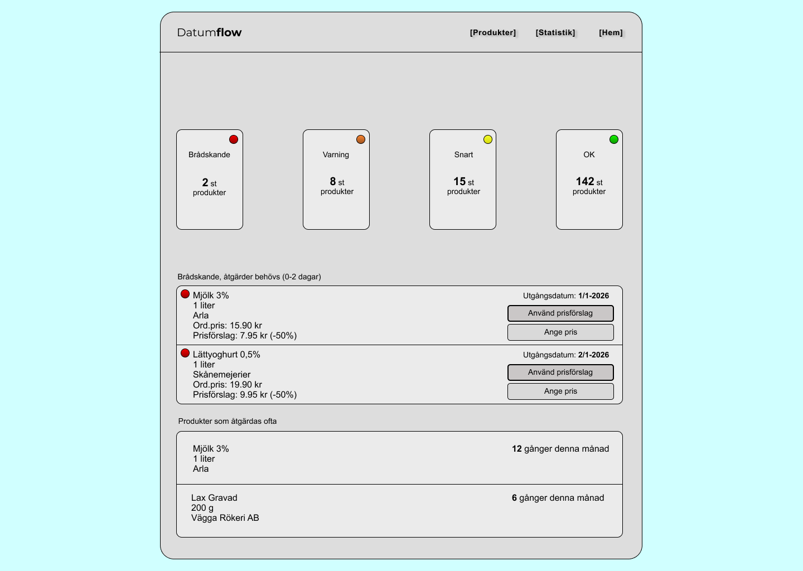
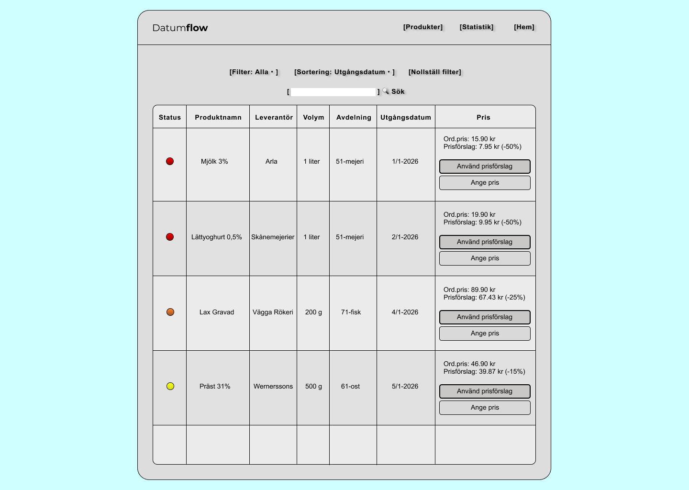
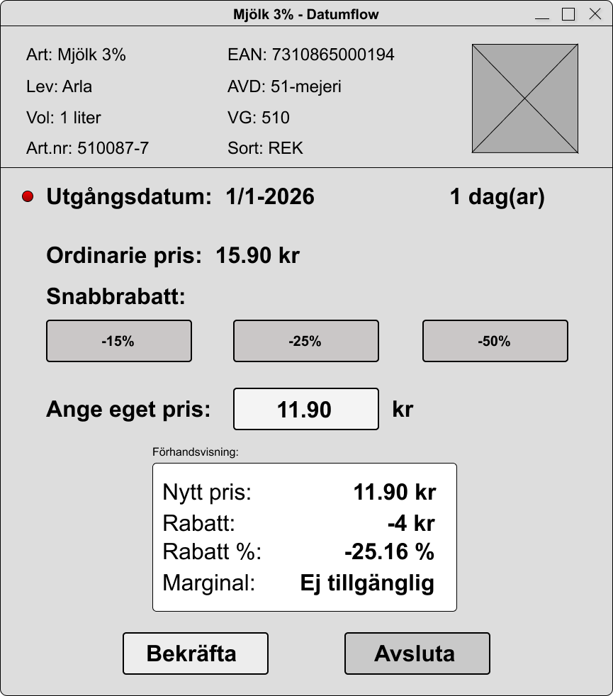
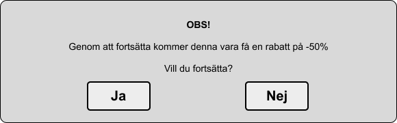

# Wireframes - DatumFlow

## Lo-fi Wireframes

Lo-fi wireframes focus on layout, functionality, and information architecture.

### Dashboard

Main view displaying:

-   Product statistics per urgency level
-   Urgent products requiring price action
-   Frequently handled products

### Product List

Detailed product list with:

-   Filter and search functionality
-   Color coding by urgency
-   Price suggestions for each product
-   Quick actions

### Price Adjustment Modal

Interactive price editing with:

-   Quick discount buttons (-15%, -25%, -50%)
-   Manual price input
-   Real-time preview of new price, discount, and margin
-   Confirm/Cancel functionality

---

## Design Principles

-   **Color Coding:** Red (0-2 days), Orange (2-3 days), Yellow (3-4 days), Green (>4 days)
-   **Hierarchy:** Most urgent information first
-   **Actions:** Primary and secondary buttons clearly separated
-   **Preview:** Show consequences before confirmation (see below)

